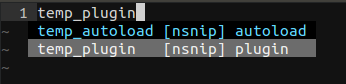

### これからはじめるVimプラグイン開発

<hr>
### Osaka.vim #1
#### @haya14busa 2014/06/28

---

自己紹介
--------

### @haya14busa
  - GitHub: [https://github.com/haya14busa](https://github.com/haya14busa)
  - Twitter: [https://twitter.com/haya14busa](https://twitter.com/haya14busa)

### Vimとの関わり
- プラグイン: [Lokaltog/vim-easymotion](https://github.com/Lokaltog/vim-easymotion)
- [Vimプラグイン読書会](http://haya14busa.github.io/reading-vimplugin/) やってます!

---

### NeoBundleで開発するプラグインを管理する

```
$ mkdir -p ~/.vim/mybundle
```

#### .vimrc
```vim
command! -nargs=1
\   MyNeoBundle
\   NeoBundle <args>, {
\       "base" : "~/.vim/mybundle",
\       "type" : "nosync",
\   }

MyNeoBundle 'incsearch.vim'
```

---

### ディレクトリ構成

```
incsearch.vim/
  plugin/
    incsearch.vim
  autoload/
    incsearch.vim
    etc...
  doc/
    incsearch.txt
```

```
$ mkdir autoload
$ mkdir plugin
$ touch {plugin,autoload}/incsearch.vim
```

---

### テンプレ書く

- [Shougo/neosnippet.vim](https://github.com/Shougo/neosnippet.vim) で登録しておくと便利



- 参考: [vim.snip](https://github.com/haya14busa/haya14busa-snippets/blob/07912a1def29ec440c419dd653a042a4d3730ca3/neosnippets/vim.snip#L265)

--

### plugin, autoload共通テンプレ

```vim
" Saving 'cpoptions' {{{
let s:save_cpo = &cpo
set cpo&vim
" }}}

" ここに処理!

" Restore 'cpoptions' {{{
let &cpo = s:save_cpo
unlet s:save_cpo
" }}}
```

--

### plugin/ 1回だけ読み込み

```vim
scriptencoding utf-8
" Load Once {{{
if expand("%:p") ==# expand("<sfile>:p")
    unlet! g:loaded_incsearch
endif
if exists('g:loaded_incsearch')
    finish
endif
let g:loaded_incsearch = 1
" }}}
```

`:so %` した時は再読み込みする [@t9md](https://github.com/t9md)

```vim
if expand("%:p") ==# expand("<sfile>:p")
```


---

Vital!
------

[vim-jp/vital.vim](https://github.com/vim-jp/vital.vim)

```vim
NeoBundleLazy 'vim-jp/vital.vim', {
\   'autoload' : {
\     'commands' : ['Vitalize'],
\   }
\ }

NeoBundle 'osyo-manga/vital-over'
```

```
:Vitalize --name=incsearch . Over.Commandline
```

--

### Update
- アップデートの2回目以降はいろいろ省略できる
- 増やしたりするときは`+`をつける
```
:Vitalize .
:Vitalize . +Data.List
:Vitalize . -Data.List
```

---

### 基本

```vim
let v = 'Vimutable'
echo v
echom v
let d = { 'vim': 'sugoi', 'emacs': 'benri'}
echomsg string(d)
:message
:so %
```

- `<buffer>`, `<nowait>` マッピング
- プロジェクト用の簡易vimrcとか
- etc...

--

### [tyru/capture.vim](https://github.com/tyru/capture.vim)

Vimのバッファに結果を出力できる

```vim
NeoBundle 'tyru/capture.vim', {
\   'autoload' : {
\     'commands' : [ 'Capture' ],
\   }
\ }
```

#### Usage
```vim
Capture message
Capture echo variables
```

--

### [thinca/vim-prettyprint](https://github.com/thinca/vim-prettyprint)

綺麗に整形して出力

```vim
NeoBundleLazy 'thinca/vim-prettyprint', {
\   'autoload' : {
\     'commands' : 'PP',
\     'functions' : 'PP',
\   }
\ }
```

tmuxの別ペインetc..でログを流す [@t9md](https://github.com/t9md)

```vim
function! Plog(msg) "{{{
    call vimproc#system('echo "' . PP(a:msg) . '" >> ~/vim.log')
    " call Plog(' kokomade OK')
    " tail -f ~/vim.log
endfunction "}}}
```

```
$ tail -f ~/vim.log
```

--

### [thinca/vim-quickrun](https://github.com/thinca/vim-quickrun)
さくっとコードを試す

#### test.vim
```vim
for i in range(10)
  echo i
endfor
```

```vim
:Quickrun
```

--

### その他

- [rbtnn/vimconsole.vim](https://github.com/rbtnn/vimconsole.vim)
- etc..

*教えてください!*

---

Demo!
=====

---

Memo
====
- tyru/restart.vim

```
:Unite neobundle
```

からの

```
" Open plugin directory by t
call unite#custom#alias('directory', 'tabopen', 'tabvimfiler')
```


<style>
.reveal h1,
.reveal h2,
.reveal h3,
.reveal h4,
.reveal h5,
.reveal h6 {
  text-transform: none;
}

.reveal h3 {
  margin-top: 15px;
}
</style>
