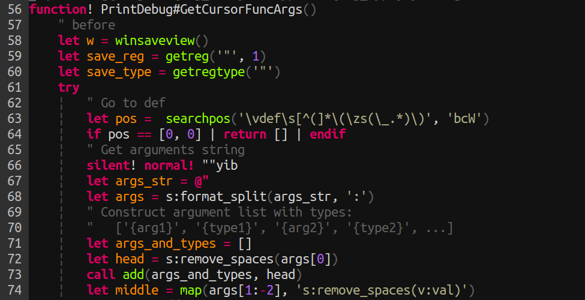
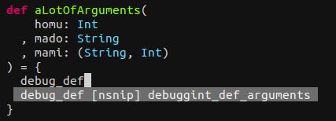
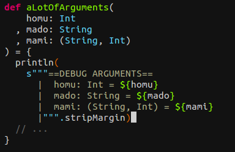

### それVimで(ry

<hr>
### ScalaMatsuri
#### @haya14busa 2014/09/07

---

本当のタイトル:
--------------

<hr>

### ~~それVimで(ry~~

---

それVimで出来まScala
--------------------

---

できまScala!!!!
===============

---

ごめんなさい
============

<br><br>
<small>あとScalaできませんカラ...</small>

---

自己紹介
--------

### @haya14busa


- GitHub: [https://github.com/haya14busa](https://github.com/haya14busa)
- Twitter: [https://twitter.com/haya14busa](https://twitter.com/haya14busa)


---

### Vimとの関わり
- Vim歴約1年半, プログラミング歴2年弱
- [1年間『Vim駆動学習』してきて最高に楽しかったのでオススメしたい](http://haya14busa.com/vim_driven_learning/)
- オンライン [vimrc読書会](http://vim-jp.org/reading-vimrc/), [Vimプラグイン読書会](http://haya14busa.github.io/reading-vimplugin/) やってます!
- プラグイン:
  - [Lokaltog/vim-easymotion](https://github.com/Lokaltog/vim-easymotion)
  - etc...

---

### Scalaとの関わり
- Scala歴4ヶ月 (今年の4月から)
- バイト応募したらScalaだった
- ほぼ初めての 静的言語 & 関数型言語

---

Scala is Fun to write!
----------------------

---

### Today I talk to...

- それVimで(ry

---

それVim(ry
----------

---

### 昨日の [@yamitzky](https://twitter.com/YAMITZKY) さんのLT

---

### チカラを込めて...`<Tab>`キーで....ｯﾀｰｰｰﾝ!


---

IntelliJ Idea? Live template? Groovy script?

<hr>

`v + <Tab>` を押すと `val {cursor} = {rhs}` に展開とか


こんなのとか
```scala
def func(homu: Int, mado: String, mami: (String, Int)) = {
  println(
    s"""==DEBUG ARGUMENTS==
      |  homu: Int = ${homu}
      |  mado: String = ${mado}
      |  mami: (String, Int) = ${mami}
      |""".stripMargin)
  // ...
}
```

---

### [Shougo/neosnippet.vim](https://github.com/Shougo/neosnippet.vim)

```
snippet     val
abbr        val variable = expression
options     head
	val ${1:#:name} = ${2:#:expression}
```

#### サクッとできる

---

#### サクッとはできないかも

```scala
def func(homu: Int, mado: String, mami: (String, Int)) = {
  println(
    s"""==DEBUG ARGUMENTS==
      |  homu: Int = ${homu}
      |  mado: String = ${mado}
      |  mami: (String, Int) = ${mami}
      |""".stripMargin)
  // ...
}
```

#### でも便利そう. どうしようかな...?

---

### IntelliJ Idea? Live template? Groovy script?
## それ Vim script で(ry

---

作った
------

GitHub(仮): [haya14busa/vim-print-debug](https://github.com/haya14busa/vim-print-debug)



<small>depends on [Shougo/neosnippet.vim](https://github.com/Shougo/neosnippet.vim)</small>

---

[Shougo/neosnippet.vim](https://github.com/Shougo/neosnippet.vim)</small>

Scala用 snippet ファイル

```
snippet     debug_def
abbr        debuggint_def_arguments
	`PrintDebug#PrintDebug('println')`
```

---

### チカラを込めて...



---

### ....ｯﾀｰｰｰﾝ!



---

DEMO
----

---

### ありがとうございました

---


<style>
.reveal h1,
.reveal h2,
.reveal h3,
.reveal h4,
.reveal h5,
.reveal h6 {
  text-transform: none;
}

.reveal h3 {
  margin-top: 15px;
}
</style>
