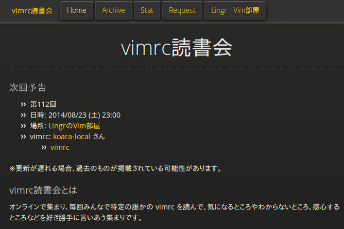
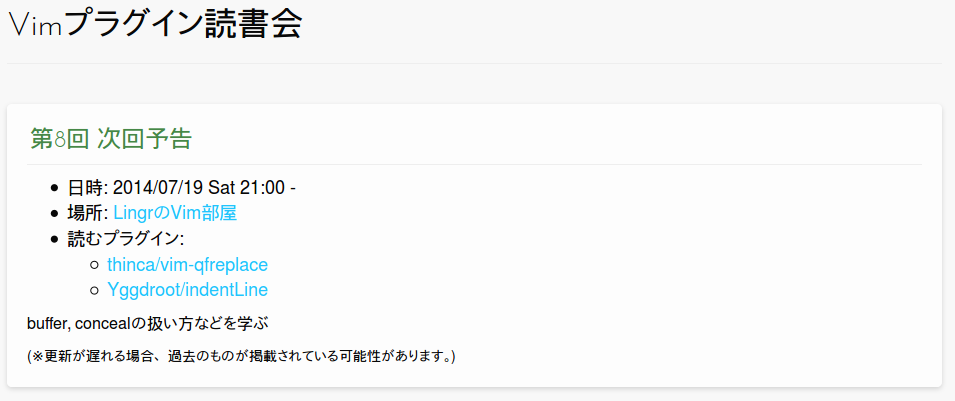
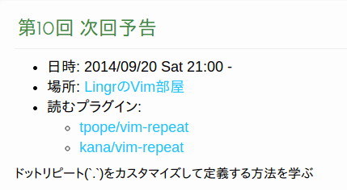

<title>オンラインVim系読書会でVim力を高めよう</title>

### オンラインVim系読書会でVim力を高めよう

### Nagoya.vim #2
#### @haya14busa 2014/09/20

---

自己紹介
--------

### @haya14busa

- GitHub: [https://github.com/haya14busa](https://github.com/haya14busa)
- Twitter: [https://twitter.com/haya14busa](https://twitter.com/haya14busa)

---

### Vimとの関わり
- Vim歴約1年半
- [1年間『Vim駆動学習』してきて最高に楽しかったのでオススメしたい](http://haya14busa.com/vim_driven_learning/)
- [vimrc読書会](http://vim-jp.org/reading-vimrc/), [Vimプラグイン読書会](http://haya14busa.github.io/reading-vimplugin/) やってます!
- プラグイン:
  - [Lokaltog/vim-easymotion](https://github.com/Lokaltog/vim-easymotion)
  - [haya14busa/incsearch.vim](https://github.com/haya14busa/incsearch.vim)
  - etc...

---

### オンラインVim系読書会

#### @LingrのVim部屋

- [vimrc読書会](http://vim-jp.org/reading-vimrc/)
- [Vimプラグイン読書会](http://haya14busa.github.io/reading-vimplugin/)
- Vim読書会
- Vim help読書会(やりたい)

---

### [vimrc読書会](http://vim-jp.org/reading-vimrc/)

---

- 毎週土曜日23:00~
- Vimカスタマイズ力向上
- mapの仕方, autocmdの書き方, 便利設定, プラグイントレンド, etc...
- ログも読める

---

### 導入
- 最初はわからなくて 当たり前
- 「hi」して他人の言及読んどく
- 実際に気になった設定コピペして試してみる
- ところで...

---

### [vimrc読書会 Stat](http://vim-jp.org/reading-vimrc/stat/#/)

<small>参考: [vimrc読書会Stat作った - haya14busa](http://haya14busa.com/reading-vimrc-stat/)</small>

---

### [vimrc読書会 Stat](http://vim-jp.org/reading-vimrc/stat/#/u/haya14busa)

---

今日もやります!!!
=================

---

### [Vimプラグイン読書会](http://haya14busa.github.io/reading-vimplugin/)

---

### [Vimプラグイン読書会](http://haya14busa.github.io/reading-vimplugin/)

---

### [Vimプラグイン読書会](http://haya14busa.github.io/reading-vimplugin/)

- 毎月土曜日 21:00~ (注: フレキシブル)
- Vim script力の向上
- 今なら[Vim script テクニックバイブル ~Vim使いの魔法の杖](http://www.amazon.co.jp/Vim-script-%E3%83%86%E3%82%AF%E3%83%8B%E3%83%83%E3%82%AF%E3%83%90%E3%82%A4%E3%83%96%E3%83%AB-~Vim%E4%BD%BF%E3%81%84%E3%81%AE%E9%AD%94%E6%B3%95%E3%81%AE%E6%9D%96-script%E3%82%B5%E3%83%9D%E3%83%BC%E3%82%BF%E3%83%BC%E3%82%BA/dp/4774166340) があるので読めば入りやすい
- 実際に著者にも質問できる!
- 読書会時に限らず、困ったら聞ける環境

---

ぜひ参加!
=========

---

### Vim help読書会

- やりたい
- Vimのhelpは膨大
- Vimは:helpからすべて学べると言っても過言じゃない

---

- [Vim documentation: help](http://vim-jp.org/vimdoc-ja/)
- [Vimのhelpを快適に引こう - haya14busa](http://haya14busa.com/reading-vim-help/)

### e.g.
- `:h usr_01.txt`
- `:h motion.txt`
- `:h text-objects`
- `:h cmdwin`

---

やりましょう!
=============

---

- 注: あくまでもVimの楽しみ方の1例でした

---

### ありがとうございました

-> http://lingr.com/signup?letmein=vim
----------------------------------------

